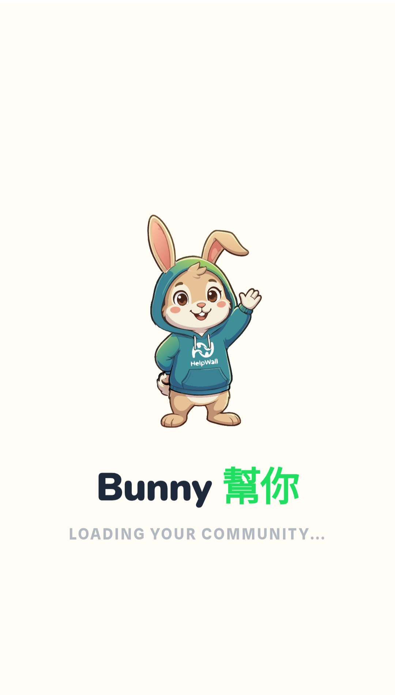
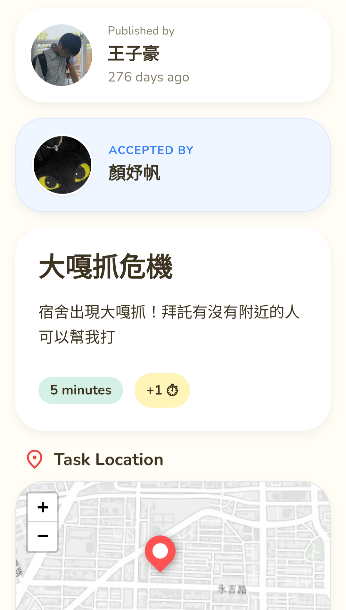
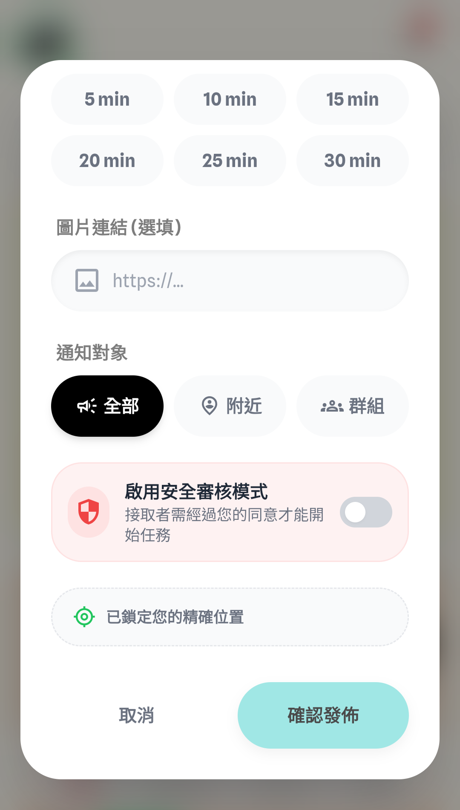
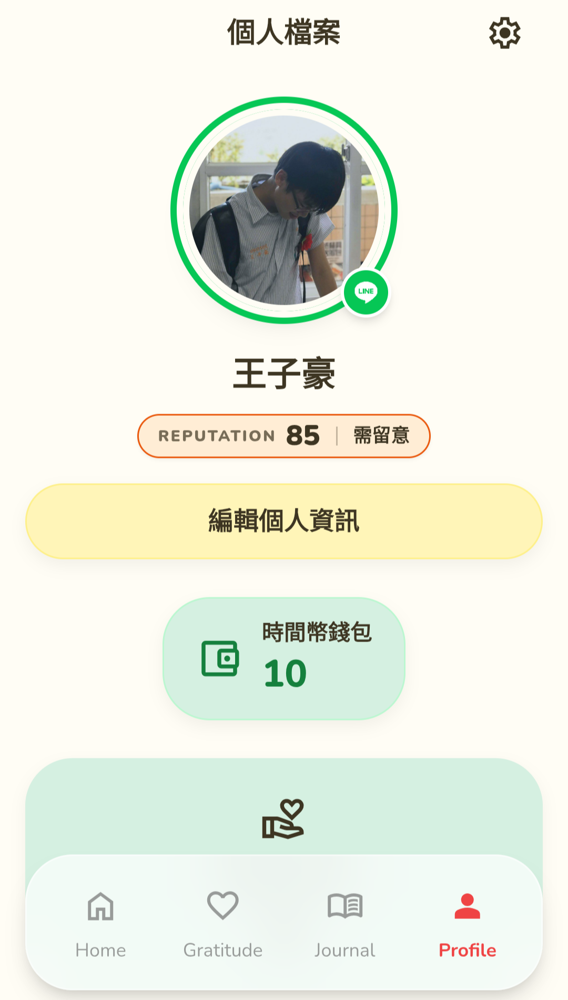

# HelpWall 幫幫牆 🐰

> **將日常需求化為任務，打造零打擾的互助生活圈。**

  

---

## 🌟 核心理念 | Core Concept

**HelpWall 幫幫牆** 致力於解決日常生活中微小卻繁瑣的求助需求（例如：順手拿杯咖啡、緊急借用行動電源）。
我們透過 **LINE Login / LIFF** 建立極低門檻的身分串接，並利用 **LINE Bot Webhook** 無縫接收群組事件。系統能自動將使用者的文字需求轉換為清晰的「任務卡片」，大幅降低在聊天群組中直接求助所帶來的打擾感與人情壓力。

---

## 雙模式互助架構 | Dual-Mode Architecture

我們結合了 **公開 LBS** 與 **私域群組** 雙軌並行的互助架構，滿足各種情境下的媒合需求：

### 📍 公開 LBS 模式 (Location-Based Service)
打破群組限制！系統會依據您當下的地理位置，自動為您媒合、推播附近的任務。無論是順路幫忙還是尋求周邊協助，都能輕鬆達成。

### 🔒 私域群組模式
專為封閉社群打造。支援綁定**企業 / 園區 / 校園**的專屬 LINE 群組，進行「定向任務發布」。在充滿信任感的私域環境中互助，安全又有效率。

---

## 📸 核心功能與畫面預覽 | Features Showcase

### 📋 任務詳情與接單
直覺的任務卡片設計，所有需求一目了然，一鍵輕鬆接單。

  

### 🚀 雙模式任務發布
支援公開 LBS 與私域群組兩種發布模式，讓您的需求精準觸達對象。

  

### 👤 個人檔案與信譽積分
深度整合 LINE 生態，完成綁定認證確保真實性。完善的評分機制，讓每一次的幫忙都轉化為珍貴的信譽累積。

  

